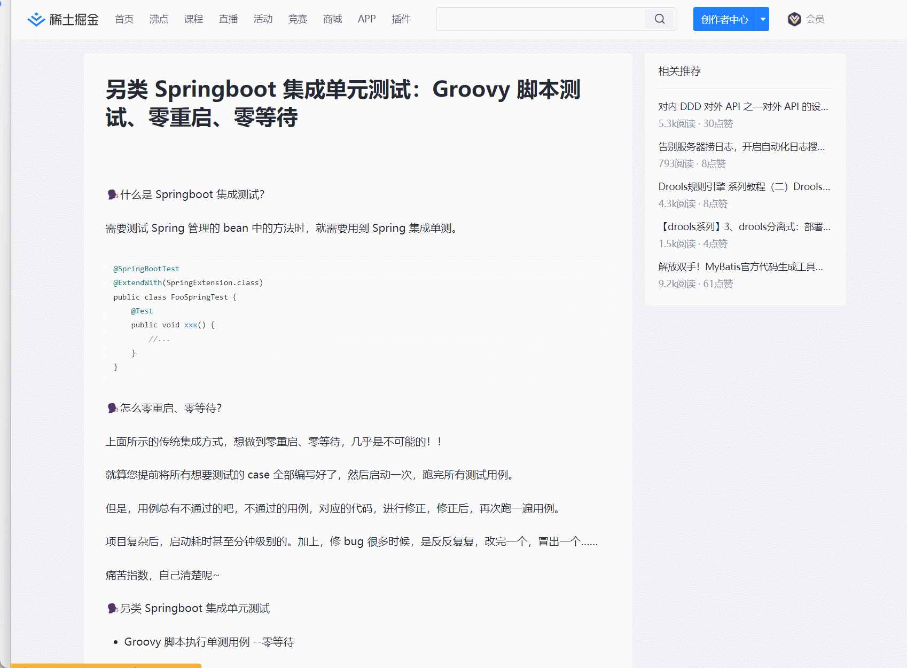

# 自动提取网页文章标题生成目录

总有一些占着流量，不关注用户体验的论坛博客，连个目录都不展示。
这样我们在看长文时，没有结构感。
一目了然目录、快速定位标题位置，应该会有点用。

本脚本，就是一键提取网页文章标题生成目录树。

- 自动生成目录树
- 自动附上标题序号
- 可拖拽
- 可跳转

<video id="video" controls="" preload="none" poster="?">
      <source id="mp4" src="./doc/Video_2023-10-23_003442.mp4" type="video/mp4">
</videos>

